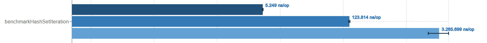

# Benchmarks - HashMap vs HashSet
# Overview
Este projeto realiza benchmarks comparativos entre as estruturas `HashMap` e `HashSet` em Java, utilizando a ferramenta JMH. O objetivo é avaliar o desempenho em operações críticas como inserção, busca, remoção e iteração, sob diferentes cargas de dados (1k, 10k e 100k elementos). Os resultados são analisados em relação às complexidades assintóticas teóricas e aos trade-offs práticos.

---

# Detalhes do ambiente de execução
- **JDK**: Oracle OpenJDK 21.0.2
- **Processador**: AMD Ryzen 7 5700U
- **Memória**: 8GB RAM

---

# Análise das estruturas

## HashMap

### Cenário do Experimento
- **Operações testadas**: `put`, `get`, `remove`, `iteration`.
- **Cargas testadas**: 1k, 10k e 100k elementos.
- **Métrica**: Tempo médio por operação em nanossegundos (quanto menor, melhor).

### Análise Geral da Implementação
O `HashMap` é uma estrutura de dados baseada em tabela hash que armazena pares chave-valor. Suas operações básicas têm complexidade **O(1)** em condições ideais (colisões mínimas), mas dependem do fator de carga e do redimensionamento interno.

### Análise dos Resultados
#### Inserção (`put`)

- Tempos consistentes (~10 ns/op), independente do tamanho.
- **Complexidade**: **O(1)** (colisões minimizadas pelo uso de `Random.nextInt(size * 10)`).

#### Busca (`get`)

- Tempos estáveis (~6 ns/op), confirmando acesso direto via hash.
- **Complexidade**: **O(1)**.

#### Remoção (`remove`)

- Performance similar à busca (~6 ns/op).
- **Complexidade**: **O(1)**.

#### Iteração (`entrySet`)

- Tempo aumenta linearmente com o tamanho: 2.1 µs (1k) → 2.68 ms (100k).
- **Complexidade**: **O(n)**, devido à necessidade de percorrer todos os buckets.

### Resumo das Operações
| Operação  | Complexidade | Observação                          |
|-----------|--------------|-------------------------------------|
| `put`     | O(1)         | Redimensionamento raro no cenário   |
| `get`     | O(1)         | Acesso direto via hash              |
| `remove`  | O(1)         | Similar à busca                     |
| `iterate` | O(n)         | Custo proporcional ao tamanho       |

---

## HashSet

### Cenário do Experimento
- **Operações testadas**: `add`, `contains`, `remove`, `iteration`.
- **Cargas testadas**: 1k, 10k e 100k elementos.

### Análise Geral da Implementação
O `HashSet` é implementado internamente como um `HashMap` com valores dummy, herdando suas características de desempenho. Opera com complexidade **O(1)** para operações básicas, desde que haja poucas colisões.

### Análise dos Resultados
#### Inserção (`add`)

- Tempos similares ao `put` do HashMap (~12 ns/op).
- **Complexidade**: **O(1)**.

#### Busca (`contains`)

- Performance equivalente ao `get` do HashMap (~6 ns/op).
- **Complexidade**: **O(1)**.

#### Remoção (`remove`)

- Tempo ligeiramente superior ao HashMap (~8 ns/op para 100k), possivelmente devido à natureza de armazenamento único.
- **Complexidade**: **O(1)**.

#### Iteração (`iterator`)

- Mais lento que o HashMap para cargas menores (5.2 µs vs 2.1 µs em 1k), mas converge para tempos similares em 100k (3.27 ms).
- **Complexidade**: **O(n)**.

### Resumo das Operações
| Operação   | Complexidade | Observação                          |
|------------|--------------|-------------------------------------|
| `add`      | O(1)         | Equivalente ao `put` do HashMap     |
| `contains` | O(1)         | Igual à busca no HashMap            |
| `remove`   | O(1)         | Custo marginalmente maior           |
| `iterate`  | O(n)         | Mais lento que HashMap em cargas menores |

---

## Comparação Crítica: HashMap vs HashSet

### Semelhanças
- Ambas têm **O(1)** para inserção, busca e remoção em cenários ideais.
- Iteração é **O(n)**, porém mais custosa em `HashSet` para pequenos volumes (devido à estrutura interna de `HashMap` com nós mais complexos).

### Diferenças
1. **Overhead de Armazenamento**:
    - `HashSet` armazena apenas chaves, enquanto `HashMap` armazena pares chave-valor. Isso explica a diferença na iteração (mais elementos para processar no `HashMap`, mas otimizações de memória podem compensar).

2. **Casos de Uso**:
    - Use `HashMap` para relacionar chaves a valores (ex.: caches).
    - Prefira `HashSet` para verificação rápida de existência (ex.: filtro de elementos únicos).

3. **Performance Prática**:
    - Operações básicas são ligeiramente mais rápidas no `HashMap`, mas a diferença é marginal (<5 ns).

---

# Conclusão
Ambas as estruturas oferecem desempenho excelente para operações básicas (**O(1)**), mas a escolha depende do contexto:
- **HashMap**: Ideal quando a relação chave-valor é necessária.
- **HashSet**: Melhor para conjuntos de elementos únicos com verificações rápidas.

Para iterações frequentes em grandes volumes, considere estruturas alternativas (ex.: `LinkedHashSet` para ordem previsível) ou otimizações específicas (ex.: pré-alocação de capacidade).

---

# Referências
- [Java HashMap Documentation](https://docs.oracle.com/en/java/javase/21/docs/api/java.base/java/util/HashMap.html)
- [Java HashSet Documentation](https://docs.oracle.com/en/java/javase/21/docs/api/java.base/java/util/HashSet.html)