# Benchmarks - Estrutura de Dados
# Overview
Este projeto visa realizar benchmarks detalhados de diversas estruturas de dados em Java, utilizando a ferramenta Java MicroBenchmarking Harness (JMH). 

Para isso, será implementado um conjunto de benchmarks, através da ferramenta de código aberto, para avaliar o desempenho das estruturas em operações indispensáveis em programação, como acesso, inserção, remoção, pesquisa e ordenação. A motivação está em entender os trade-offs associados a diferentes escolhas de estrutura e algoritmos, especialmente em situações pertinentes, como de carga elevada. A relevância do trabalho está em sua aplicação prática e paradidática, uma vez que os resultados obtidos no benchmark dos custos sobre as operações possibilita a interpretação dos fenômenos alinhada as análises assintóticas das implementações. Portanto, ao obter dados concretos de diferentes estruturas de dados e casos particulares, a tomada de decisão fica mais clara, à medida que se pode comparar distintas possibilidades de implementação de estruturas de dados, de acordo com a problemática. 
# Funcionalidades
Utilizando o projeto open source JMH, desenvolveremos códigos para benchmarks, executaremos os experimentos, coletaremos os resultados e realizaremos análises detalhadas. As análises incluirão a interpretação dos resultados com base em complexidades assintóticas para compreender os padrões observados e validar hipóteses de desempenho.

Para o controle de carga, aumentaremos gradativamente o número de elementos armazenados nas estruturas e a quantidade de operações realizadas. Com isso, compararemos o impacto no desempenho à medida que os tamanhos das estruturas aumentam e o desempenho de diferentes algoritmos para resolução de uma mesma problemática.

# Como executar os benchmarks
1. Clone esse repositório
2. Caso não possua o Maven instalado na sua máquina, certifique-se de instalar seguindo as instruções do site oficial: [Apache Maven](https://maven.apache.org/download.cgi)
3. Se utilizando alguma IDE, certifique-se que ela possui acesso ao catálogo central, e procure o arquetipo `org.openjdk.jmh:jmh-$Java-benchmark-archetype`
4. Compile o projeto digitando `mvn clean install` no seu terminal
5. Execute os benchmarks


# Detalhes do ambiente em que o benchmark foi executado
darlan_almeida@tigre:~/Benchmarks_Estrutura_De_Dados$ java --version 
openjdk 11.0.26 2025-01-21
OpenJDK Runtime Environment (build 11.0.26+4-post-Ubuntu-1ubuntu122.04)
OpenJDK 64-Bit Server VM (build 11.0.26+4-post-Ubuntu-1ubuntu122.04, mixed mode, sharing

maquina:

# Análise das estruturas

## Arvóres

## BST

### Cenário do Experimento

Para o experimento, foi utilizado uma arvore totalmente balanceada e o pior caso possível para desbalanceamento, ou seja, inserções ordenadas de elementos.

### Análise dos Resultados

### Eficiência na Inserção

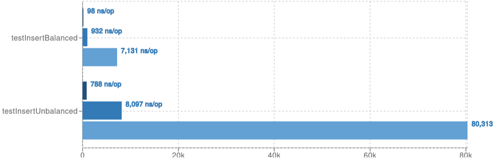


A inserção é mais eficiente em uma árvore balanceada:

- **Árvore balanceada:** a inserção ocorre em `O(log(n))`.
- **Árvore desbalanceada:** a inserção ocorre em `O(n)`, pois é necessário percorrer toda a estrutura até encontrar o elemento correto no final da estrutura.

Esse comportamento evidencia a vantagem das árvores balanceadas para operações de inserção em cenários onde não existe uma posição que referencia o valor do elemento.

### Eficiência na remoção

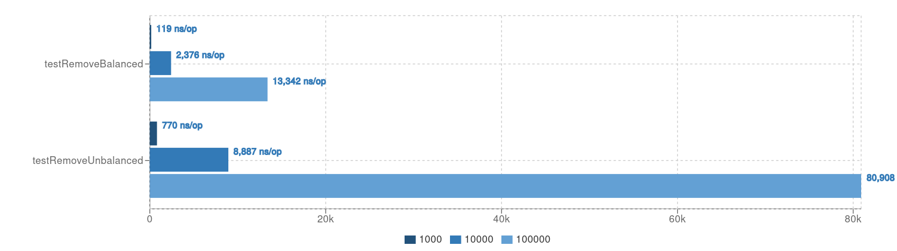


A remoção é mais eficiente em uma árvore balanceada:

- **Árvore balanceada:** a remoção ocorre em `O(log(n))`. Sendo necessário buscar o elemento ``O(log(n))` remove-lo e fazer a busca pelo seu predecessor ou successor `O(log(n))`
- **Árvore desbalanceada:** a inserção ocorre em `O(n)`, pois é necessário percorrer toda a estrutura até encontrar o elemento correto no final da estrutura.

Esse comportamento evidencia a vantagem das árvores balanceadas para operações de inserção em cenários onde não existe uma posição que referencia o valor do elemento.

### Eficiência na Buscas

#### Busca do Máximo (`maxBalanced`):

- Em uma árvore balanceada, essa operação ocorre em **`O(log(n))`**, garantindo eficiência independente do caso de inserção.
- Na árvore desbalanceada, é necessário percorrer toda a estrutura, resultando em **`O(n)`** no pior caso.

#### Busca do Mínimo (`min`):

- No cenário desbalanceado utilizado, onde as inserções foram feitas em ordem crescente, a busca do mínimo ocorre em **`O(1)`**, pois o menor elemento está sempre na raiz, uma vez que ele não tem elemento a esquerda.

```Node min(Node node) {
        if (node.left == null) return node;
        else return min(node.left);
    }
```

- Vale ressaltar que, caso as inserções fossem feitas em ordem decrescente, o comportamento se inverteria, tornando a busca do mínimo mais custosa na árvore desbalanceada.
- Na árvore balanceada, essa operação mantém a complexidade **`O(log(n))`**, independentemente da ordem de inserção.

Essa análise mostra que, apesar de árvores balanceadas garantirem previsibilidade nos custos das operações de busca, a estrutura desbalanceada pode apresentar vantagens em cenários específicos de inserção ordenada.

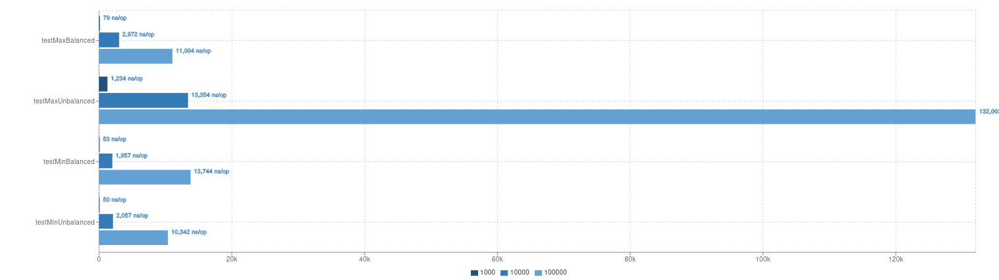


#### Busca pelo elemento:
- Se o elemento for igual à chave do nó atual, encontramos o elemento, caso contrario faz as buscas nas subárvores a direita ou a esquerda
- Em uma árvore balanceada, a busca ocorre em **`O(log(n))`**.
-- Em uma árvore desbalanceada, a busca ocorre em **`O(n)`**.


#### Sucessor:

- O sucessor de um nó é o menor elemento que é maior que ele.
- Em uma árvore balanceada, a busca ocorre em **`O(log(n))`**.
- Se o nó tem um filho direito, o sucessor é o menor elemento dessa subárvore.
- Se não tem filho direito, sobe-se na árvore até encontrar o primeiro ancestral cujo filho esquerdo contém o nó original.
  
#### Predecessor:

- O predecessor de um nó é o maior elemento que é menor que ele.
- Em uma árvore balanceada, a busca ocorre em **`O(log(n))`**.
- Se o nó tem um filho esquerdo, o predecessor é o maior elemento dessa subárvore.
- Se não tem filho esquerdo, sobe-se na árvore até encontrar o primeiro ancestral cujo filho direito contém o nó original.
  
Em uma árvore desbalanceada, as operações podem degradar para **`O(n)`** no pior caso, pois pode ser necessário percorrer toda a estrutura para encontrar o sucessor ou predecessor.

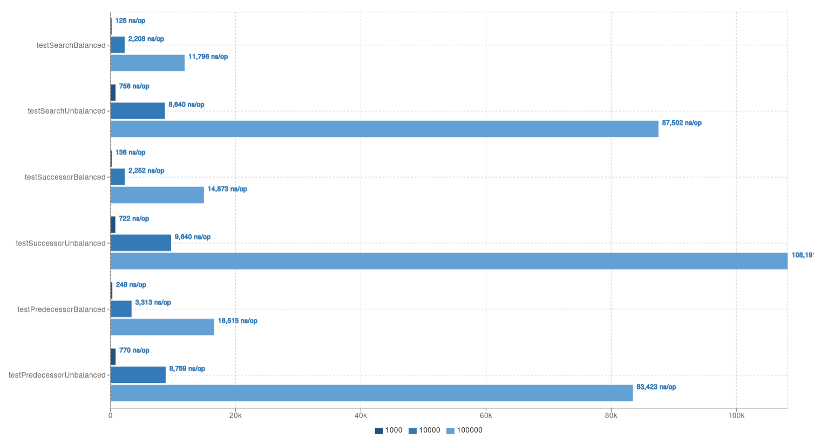

#### Percurso In-Order

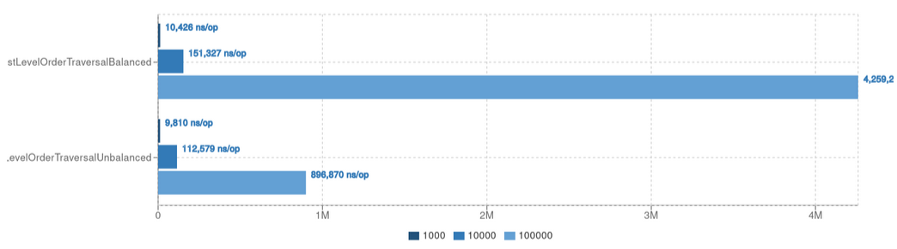


No benchmark apresentado, o percurso **in-order** na árvore balanceada (`testInOrderTraversalBalanced`) mostrou-se mais lento do que na árvore desbalanceada (`testInOrderTraversalUnbalanced`). Esse resultado pode parecer contraintuitivo à primeira vista.

#### Motivo:

- Em uma árvore balanceada, os acessos à memória são menos sequenciais devido à estrutura mais ramificada, o que pode resultar em mais **cache misses**, prejudicando a performance.
- Em uma árvore desbalanceada, o percurso tende a ser mais linear, favorecendo a leitura sequencial da memória e reduzindo os acessos aleatórios.
- Como ambos os percursos possuem complexidade `O(n)`, a diferença de desempenho pode ser explicada pela quantidade de chamadas recursivas: na árvore desbalanceada, as chamadas recursivas são feitas apenas para um lado da árvore, reduzindo a sobrecarga de movimentação de memória.


#### Resumo Das Operações em BST

- **testInsert**: A inserção em uma BST balanceada tem complexidade `O(log n)`, mas pode chegar a `O(n)` em casos desbalanceados.
- **testInOrderTraversal**: O percurso in-order em uma árvore desbalanceada pode ser mais rápido devido à maior localidade de cache e chamadas recursivas reduzidas.
- **testMax**: Encontrar o valor máximo em uma árvore balanceada ocorre em `O(log n)`, enquanto em uma árvore desbalanceada pode chegar a `O(n)`.
- **testMin**: Em um caso desbalanceado com inserção ordenada crescente, a busca do mínimo ocorre em `O(1)`, enquanto em uma árvore balanceada ocorre em `O(log n)`.
- **testSuccessor**: A busca pelo sucessor de um nó ocorre em `O(log n)` em uma árvore balanceada, mas pode degradar para `O(n)` em uma árvore desbalanceada.
- **testPredecessor**: Similar ao sucessor, o predecessor é encontrado em `O(log n)` na árvore balanceada, enquanto na desbalanceada pode atingir `O(n)`.


### PriorityDeque

### Cenário do Experimento

Para o experimento, foram utilizados os metódos da API PriorityDeque de JAVA. Essa estrutura de dados é fundamentada em um Heap-Max.

### Análise dos Resultados
### Inserção

- **testInsert**: A inserção em uma Priority Deque tem complexidade `O(log n)` devido à manutenção da ordenação na estrutura de heap a cada inserção de elemento. Isso para cumprir o conceito de que todos os nós filhos tem valores menores do que o nó pai
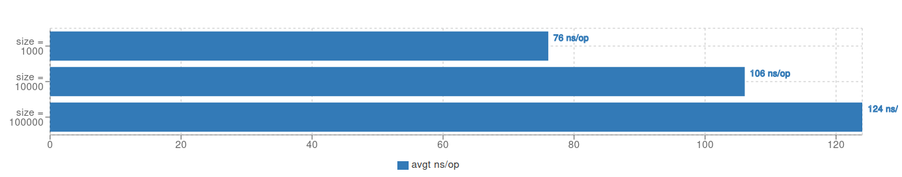


### Remoção

- **testRemove**: A remoção segue `O(log n)` em média, pois envolve a reestruturação da heap para manter a prioridade correta dos elementos.
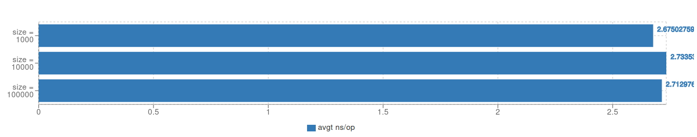


### Contém

- **testContains**: A busca por um elemento pode ter um custo elevado, chegando a `O(n)` no pior caso.
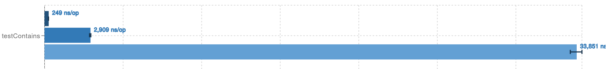


### Consulta do Elemento de Maior Prioridade

- **testPeek**: A operação de *peek* (consulta ao elemento de maior prioridade) ocorre em `O(1)`, já que o topo da heap mantém o elemento prioritário acessível diretamente.
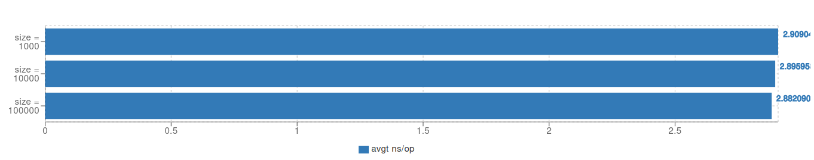

### Resumo
- **testInsert (Priority Deque)**: Inserção ocorre em `O(log n)`.
- **testRemove (Priority Deque)**: Remoção ocorre em `O(log n)`.
- **testContains (Priority Deque)**: Busca pode chegar a `O(n)`.
- **testPeek (Priority Deque)**: Consulta ao maior elemento ocorre em `O(1)`. 
## TreeSet e TreeMap

### Cenário do Experimento

Para este experimento, foram analisadas as operações em `TreeSet` e `TreeMap`, estruturas que utilizam árvores balanceadas para armazenar elementos de forma ordenada. O objetivo foi avaliar a eficiência dessas operações e entender o impacto da estrutura subjacente na complexidade de tempo.

### Análise dos Resultados

### Eficiência nas Operações do TreeSet

O `TreeSet` é baseado em uma árvore balanceada, garantindo eficiência nas operações fundamentais.

#### Inserção (`testInsert`)
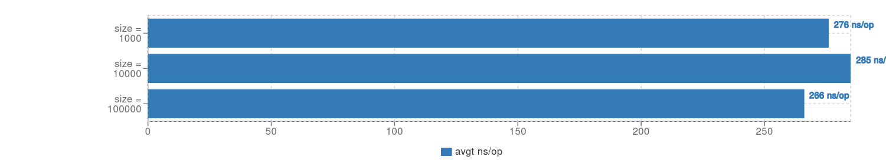

- **Complexidade:** `O(log n)`
- A estrutura mantém a ordenação dos elementos, garantindo inserções eficientes.


#### Busca (`testContains`)
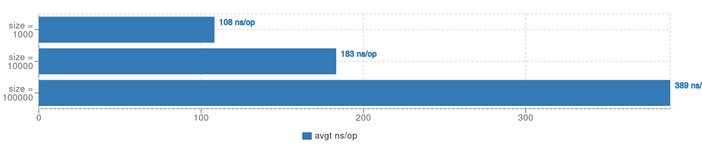

- **Complexidade:** `O(log n)`
- A busca percorre a árvore até localizar o elemento desejado.

#### Remoção (`testRemove`)
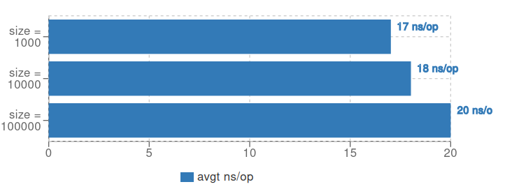
- **Complexidade:** `O(log n)`
- Envolve reorganizar a árvore para preservar sua propriedade de ordenação.


#### Busca de Elementos Específicos (`testFloor/testCeiling`)
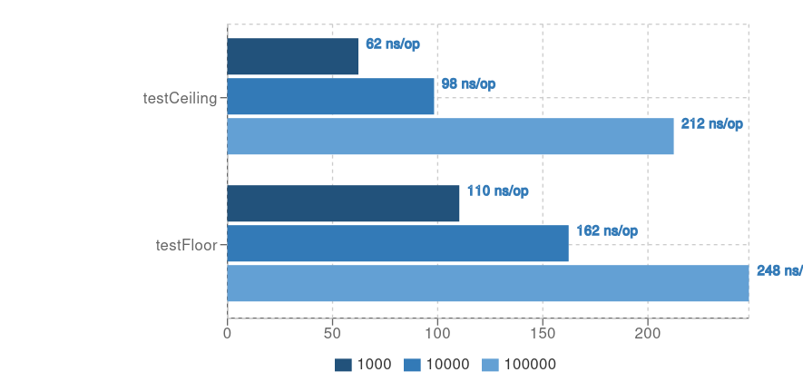

- **Complexidade:** `O(log n)`
- `testFloor`: Encontra o maior elemento menor ou igual ao valor consultado.
- `testCeiling`: Encontra o menor elemento maior ou igual ao valor consultado.

#### Busca do Mínimo e Máximo (`testMin/testMax`)
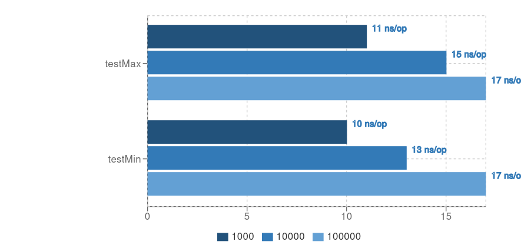

- **Complexidade:** `O(1)`
- A estrutura mantém referências diretas para os extremos, garantindo acessos imediatos.

#### Iteração Reversa (`testDescendingIteration`)
- **Complexidade:** `O(n)`
- Gera uma cópia reversa da árvore, exigindo percorrer todos os elementos.
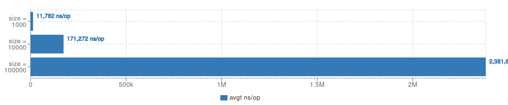


### Resumo das Operações

- **testInsert:** `O(log n)`
- **testContains:** `O(log n)`
- **testRemove:** `O(log n)`
- **testFloor/testCeiling:** `O(log n)`
- **testMin/testMax:** `O(1)`
- **testDescendingIteration:** `O(n)`
### Eficiência nas Operações do TreeMap

O `TreeMap` utiliza uma estrutura similar ao `TreeSet`, mas organiza os elementos com base em pares chave-valor. Suas operações possuem complexidades similares.

#### Inserção (`testInsert`)
- **Complexidade:** `O(log n)`
- Mantém a ordenação das chaves automaticamente.

#### Busca (`testContains`)
- **Complexidade:** `O(log n)`
- Exige percorrer a árvore para verificar a existência da chave consultada.

#### Remoção (`testRemove`)
- **Complexidade:** `O(log n)`
- Necessária reestruturação da árvore após a remoção.

#### Busca do Mínimo e Máximo (`testMin/testMax`)
- **Complexidade:** `O(1)`
- As referências diretas aos extremos garantem acessos rápidos.

#### Iteração sobre o Conjunto de Chaves (`testKeySetIteration`)
- **Complexidade:** `O(n)`
- Todas as chaves são percorridas de forma ordenada.

### Resumo das Operações

#### TreeMap
- **testInsert:** `O(log n)`
- **testContains:** `O(log n)`
- **testRemove:** `O(log n)`
- **testMin/testMax:** `O(1)`
- **testKeySetIteration:** `O(n)`

A análise confirma que ambas as estruturas são eficientes para operações ordenadas, sendo ideais para cenários que exigem buscas rápidas e inserções estruturadas.

### Conclusão
- **BST** é eficiente quando balanceada, mas pode ter desempenho ruim caso contrário.
- **PriorityDeque** é ótima para operações de prioridade, mas não é eficiente para buscas arbitrárias.
- **TreeSet e TreeMap** oferecem ordenação automática, com desempenho logarítmico para operações básicas.

A escolha da estrutura depende do caso de uso: se precisar de busca rápida, use HashMap; para ordenação, prefira TreeSet/TreeMap; se precisar de prioridade, use PriorityDeque.


# Dependências
[JMH](https://github.com/openjdk/jmh)
