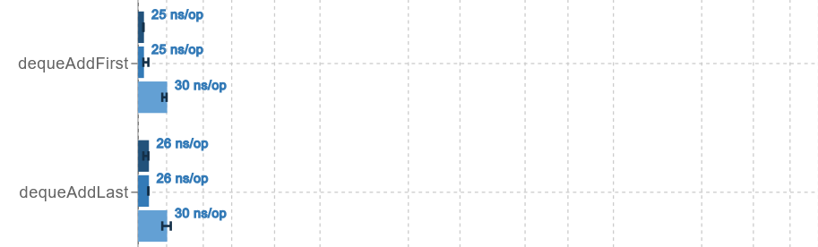
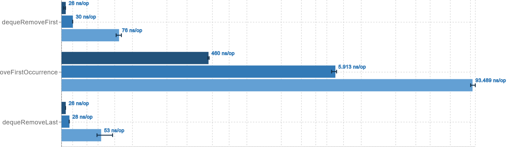
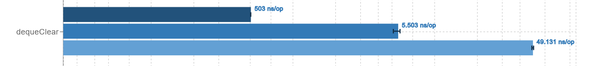
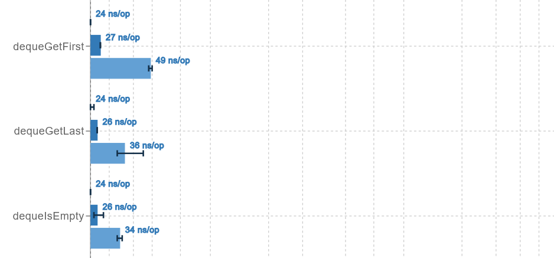
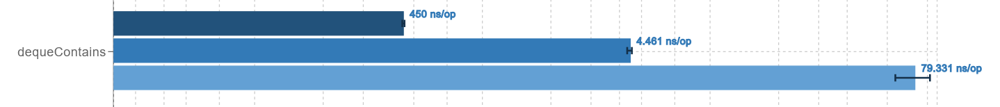
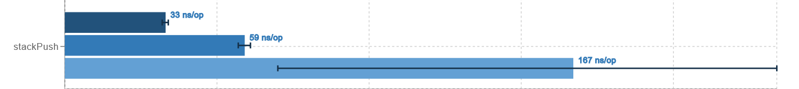
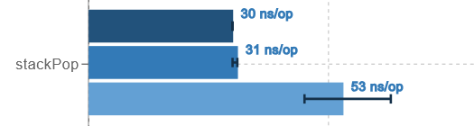
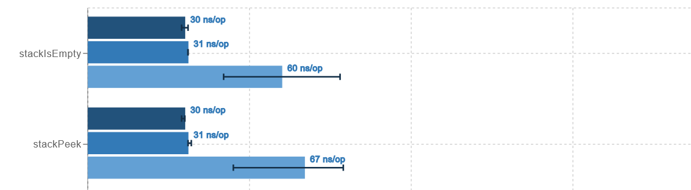

# Benchmarks - Estrutura de Dados
# Overview
Este projeto visa realizar benchmarks detalhados de diversas estruturas de dados em Java, utilizando a ferramenta Java MicroBenchmarking Harness (JMH).

Para isso, será implementado um conjunto de benchmarks, através da ferramenta de código aberto, para avaliar o desempenho das estruturas em operações indispensáveis em programação, como acesso, inserção, remoção, pesquisa e ordenação. A motivação está em entender os trade-offs associados a diferentes escolhas de estrutura e algoritmos, especialmente em situações pertinentes, como de carga elevada. A relevância do trabalho está em sua aplicação prática e paradidática, uma vez que os resultados obtidos no benchmark dos custos sobre as operações possibilita a interpretação dos fenômenos alinhada as análises assintóticas das implementações. Portanto, ao obter dados concretos de diferentes estruturas de dados e casos particulares, a tomada de decisão fica mais clara, à medida que se pode comparar distintas possibilidades de implementação de estruturas de dados, de acordo com a problemática.
# Funcionalidades
Utilizando o projeto open source JMH, desenvolveremos códigos para benchmarks, executaremos os experimentos, coletaremos os resultados e realizaremos análises detalhadas. As análises incluirão a interpretação dos resultados com base em complexidades assintóticas para compreender os padrões observados e validar hipóteses de desempenho.

Para o controle de carga, aumentaremos gradativamente o número de elementos armazenados nas estruturas e a quantidade de operações realizadas. Com isso, compararemos o impacto no desempenho à medida que os tamanhos das estruturas aumentam e o desempenho de diferentes algoritmos para resolução de uma mesma problemática.

# Como executar os benchmarks
1. Clone esse repositório
2. Caso não possua o Maven instalado na sua máquina, certifique-se de instalar seguindo as instruções do site oficial: [Apache Maven](https://maven.apache.org/download.cgi)
3. Se utilizando alguma IDE, certifique-se que ela possui acesso ao catálogo central, e procure o arquetipo `org.openjdk.jmh:jmh-$Java-benchmark-archetype`
4. Compile o projeto digitando `mvn clean install` no seu terminal
5. Execute os benchmarks

# Detalhes do ambiente em que o benchmark foi executado
openjdk 11.0.26 2025-01-21
OpenJDK Runtime Environment (build 11.0.26+4-post-Ubuntu-1ubuntu122.04)
OpenJDK 64-Bit Server VM (build 11.0.26+4-post-Ubuntu-1ubuntu122.04, mixed mode, sharing

# Análise das estruturas
**Todo o código base utilizado nos testes está disponível no arquivo "benchmarks", devidamente documentado para facilitar o entendimento e manipulação própria dos métodos. Além disso, está disponível uma tabela de resultados sobre cada estrutura no arquivo "dados".**

## ArrayDeque

### Cenário do Experimento

Para o experimento, foi utilizado deques populados com três tamanhos gradativamente maiores. Todos os resultados estão no formato nanossegundos/operação, ou seja, quanto menor mais rápido. E estão em formato decrescente, do menor deque para o maior.

### Análise Geral da Implementação da Estrutura

ArrayDeque, em java, é uma implementação de fila dupla baseada em um array redimensionável circular, não-baseado em index, tendo sua política de crescimento não documentada e variável de acordo com a versão do JDK.

### Análise dos Resultados

### Eficiência na Inserção

 

Observamos uma inserção eficiente em ambas as extremidades do deque, com resultados semelhantes.

- Ambas as inserções ocorre em **`O(1)`**
- No pior caso, quando acontece o redimensionamento do array, a inserção ocorre em **`O(n)`**

### Eficiência na Remoção

Observamos que as remoções simples, em ambas as extremidades do deque, são bem eficientes.

- Ambas ocorrem em **`O(1)`** 

O método removeFirstOccurrence busca e remove a primeira ocorrência do objeto informado no deque.

- Ou seja, ocorre em **`O(n)`**, visto que pode precisar percorrer o deque todo para encontrar (uu até não encontrar!)

ArrayDeque possui também o método removeLastOccurrence, que, de forma análoga, é semelhante ao removeFirstOccrrence. (Faça uma modificação simples no código de benchmark e veja!)

ArrayDeque possui também o método clear, que remove todo os elementos do deque.

- Ele define as referências de cada elemento do deque como null, ou seja, ocorre em **`O(n)`**

### Eficiência na Busca

Observamos que o retorno dos elementos nas extremidades, bem como o teste se o deque é vazio, são bem eficientes.

- Todos ocorrem em **`O(1)`**

O método contains procura o objeto do inicio ao fim do deque e retorna true se achar ele.

- Semelhante ao removeFirstOccurrence, ele pode ter que percorrer o deque todo. Achando ou não, ocorre em **`O(n)`**.

### Resumo das operações em ArrayDeque

- addFirst e addLast: ocorrem em **`O(1)`** usualmente, **`O(n)`** quando ocorrer redimensionamento do array.
- removeFirst e removeLast: ocorrem em **`O(1)`**
- removeFirstOccurrence e removeLastOccurrence: ocorrem em **`O(n)`**
- clear: ocorre em **`O(n)`**
- getFirst, getLast e isEmpty: ocorrem em **`O(1)`**
- contains: ocorre em **`O(n)`**

## Stack

### Cenário do Experimento

Para o experimento, foi utilizado deques populados com três tamanhos gradativamente maiores. Todos os resultados estão no formato nanossegundos/operação, ou seja, quanto menor mais rápido. E estão em formato decrescente, do menor deque para o maior.

### Análise Geral da Implementação da Estrutura

A classe Stack em java é uma classe legado, herdeira da classe Vector, que implementa uma estrutura LIFO(last-in-first-out), ou seja, o último elemento inserido é o que será removido, de onde vem o seu nome Stack(pilha). Ela é uma classe legado por ter sido utilizada em versões anteriores de java, mas foi reestruturada ao longo das novas versões, substituida por Deque.

### Análise dos Resultados

### Eficiência na Inserção

Adiciona sempre no fim do Stack

- Ocorre em **`O(1)`**

### Eficiência na Remoção

Remove sempre no fim do Stack

- Ocorre em **`O(1)`**

### Eficiência na Busca

O método peek retorna o último elemento do Stack e isEmpty verifica se o vetor é vazio

- Ambas ocorre em **`O(1)`**

### Resumo das operações em Stack

- Todas as operações ocorrem em **`O(1)`**

### Operações de Stack que quebram a política de LIFO

Como a clase Stack herda a classe Vector, é possível utilizar métodos de Vector, como insertElementAt(que adiciona um elemento em um index, fazendo shift) e removeElementAt(remove um elemento por index) que ferem a política de last-in-first-out.

Os métodos de Vector utilizados como uma pilha, como por exemplo removeElementAt(últimoIndex) = pop(), vão ter resultados semelhantes aos métodos básicos de Stack. 

Não achamos pertinente testar esses métodos de Vector por serem contrarios a ideia da classe Stack, mas eles podem ser testados facilmente ao modificar a classe *StackBenchmark* no arquivo *Benchmarks*. 

## Para representação de Pilhas, qual usar?

Uma dúvida frequente é qual estrutura usar para representar pilhas em Java.

A resposta é simples, e pode ser facilmente subentendida ao longo da análise, use ArrayDeque.

Stack é uma classe legado, baseada em uma API antiga da linguagem, que possui métodos que quebram a política de pilha. ArrayDeque é mais nova, flexível, eficiente, e recomendada pela documentação oficial de Java.

# Referencias

[Java Documentation](https://github.com/openjdk/jmh)