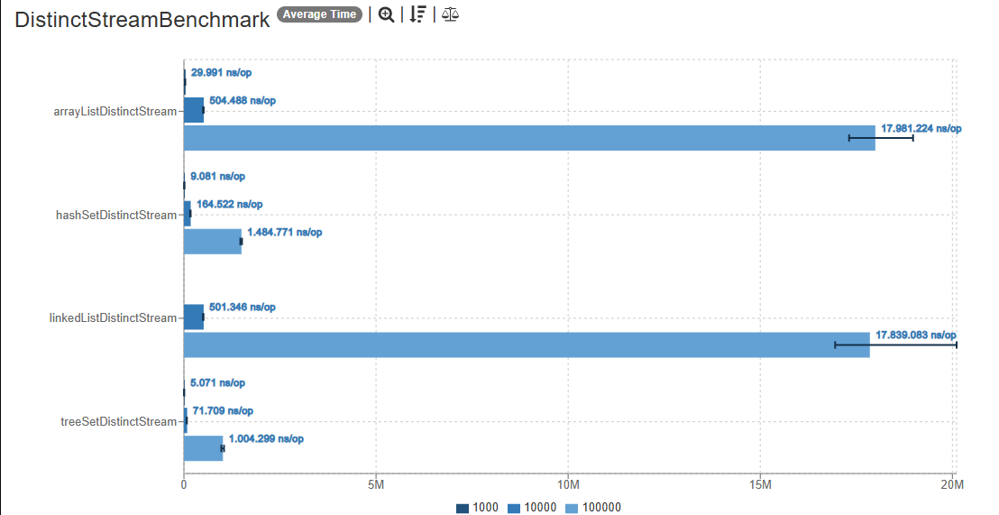
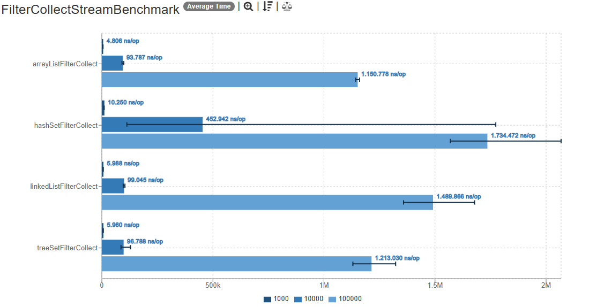
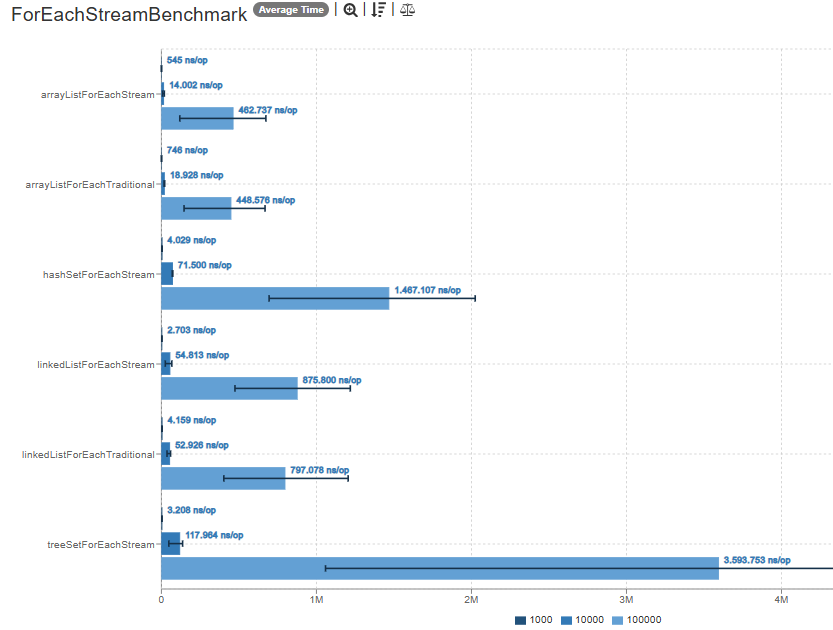

# Benchmarks - Estrutura de Dados
# Overview
Este projeto visa realizar benchmarks detalhados de diversas estruturas de dados em Java, utilizando a ferramenta Java MicroBenchmarking Harness (JMH).

Para isso, será implementado um conjunto de benchmarks, através da ferramenta de código aberto, para avaliar o desempenho das estruturas em operações indispensáveis em programação, como acesso, inserção, remoção, pesquisa e ordenação. A motivação está em entender os trade-offs associados a diferentes escolhas de estrutura e algoritmos, especialmente em situações pertinentes, como de carga elevada. A relevância do trabalho está em sua aplicação prática e paradidática, uma vez que os resultados obtidos no benchmark dos custos sobre as operações possibilita a interpretação dos fenômenos alinhada as análises assintóticas das implementações. Portanto, ao obter dados concretos de diferentes estruturas de dados e casos particulares, a tomada de decisão fica mais clara, à medida que se pode comparar distintas possibilidades de implementação de estruturas de dados, de acordo com a problemática.
# Funcionalidades
Utilizando o projeto open source JMH, desenvolveremos códigos para benchmarks, executaremos os experimentos, coletaremos os resultados e realizaremos análises detalhadas. As análises incluirão a interpretação dos resultados com base em complexidades assintóticas para compreender os padrões observados e validar hipóteses de desempenho.

Para o controle de carga, aumentaremos gradativamente o número de elementos armazenados nas estruturas e a quantidade de operações realizadas. Com isso, compararemos o impacto no desempenho à medida que os tamanhos das estruturas aumentam e o desempenho de diferentes algoritmos para resolução de uma mesma problemática.

# Como executar os benchmarks
1. Clone esse repositório
2. Caso não possua o Maven instalado na sua máquina, certifique-se de instalar seguindo as instruções do site oficial: [Apache Maven](https://maven.apache.org/download.cgi)
3. Se utilizando alguma IDE, certifique-se que ela possui acesso ao catálogo central, e procure o arquetipo `org.openjdk.jmh:jmh-$Java-benchmark-archetype`
4. Compile o projeto digitando `mvn clean install` no seu terminal
5. Execute os benchmarks

# Detalhes do ambiente em que o benchmark foi executado
Oracle OpenJDK 21.0.2
System Model: H110M-S2V
Processor: Intel(R) Celeron(R) CPU G3930 @ 2.90GHz (2 CPUs), ~2.9GHz
Memory: 8192MB RAM

# Análise das estruturas sob uso da Java Stream API

## Análise do método .distinct() nas estruturas: LinkedList, ArrayList, HashSet, TreeSet

Motivação: o distinct() retorna um novo stream sem os elementos duplicados. Ele implementa, internamente, um LinkedHashSet, que é muito útil para filtrar duplicatas e manter a ordem original dos elementos.
O distinct() é muito útil nesse sentido, pois, sem ele, teríamos que fazer um filtro manualmente com um Set. Além disso, como a API trabalha com operações imutáveis e encadeadas, ele é muito útil em pipelines.

### Cenário do Experimento

Para o experimento, utilizou-se quatro estruturas diferentes: LinkedList, ArrayList, HashSet e TreeSet. Elas foram populadas, em cada benchmark, com 1000, 10000 e 100000 elementos inteiros aleatórios.

### Análise dos Resultados

Como é preciso popular um Set com a mesma quantidade de elementos (no pior caso, teremos as estruturas com todos os elementos distintos), o custo do método é O(n) em relação à memória.
Em relação ao custo de processamento (que está intimamente ligado com percorrer a estrutura), pode-se perceber que a ArrayList e a LinkedList possuem os piores desempenhos (O(n), pois precisa-se percorrer todos elementos da estrutura).
Evidencia-se uma superioridade assintótica das estruturas HashSet e TreeSet pelo contrato do Set: não possuir elementos duplicados.

Conclusão: como sets já são únicos, o distinct() quase não tem custo, se comparado às estruturas que implementam List. Para ArrayList e LinkedList, o custo é alto, pois precia-se criar e popular um Set.

---

## Análise do método .filter() nas estruturas: LinkedList, ArrayList, HashSet, TreeSet

Motivação: filter() e collect() são métodos muito comuns em pipelines com Stream. O filter possibilita a filtragem de dados que seguem um determinado predicado, como ser par ou ímpar, por exemplo.

### Cenário do Experimento

Para o experimento, utilizou-se quatro estruturas diferentes: LinkedList, ArrayList, HashSet e TreeSet. Elas foram populadas, em cada benchmark, com 1000, 10000 e 100000 elementos inteiros aleatórios.

### Análise dos Resultados

Pode-se perceber o alto desempenho performado pela ArrayList, devido ao seu acesso rápido por índices e a otimização de caches da própria JVM.
Como não há acesso aleatório em uma LinkedList, acaba que o custo de navegação e a alocação frequente de collect() tornam a estrutura mais lenta para grandes entradas.
Para o HashSet, o custo de busta é ótimo, mas o custo do collect() para uma lista utiliza-se de iteração, afetando a eficiência do pipeline porque não há ordem definida em um hashSet.
No caso do TreeSet, a iteração é ordenada, o que adiciona mais carga e a torna mais custosa que as listas, por exemplo.

Conclusão: observa-se que as listas possuem um maior desempenho geral comparado às outras estruturas, possibilitando maior flexibilidade e maior casos de usos para as mesmas.

## Análise do método .foreach() e foreach tradicional nas estruturas: LinkedList, ArrayList, HashSet, TreeSet

Motivação: o método foreach() é muito útil em contextos de transformações e filtragem de dados em pipelines, também permitindo paralelismo, o que melhora seu desempenho em múltiplas threads.
Além disso, melhora a concisão e a legibilidade do código.

### Cenário do Experimento

Para o experimento, utilizou-se quatro estruturas diferentes: LinkedList, ArrayList, HashSet e TreeSet. Elas foram populadas, em cada benchmark, com 1000, 10000 e 100000 elementos inteiros aleatórios.

### Análise dos Resultados

Para entradas grandes, nota-se o maior desempenho dos for each tradicionais, visto que são mais otimizados pela própria JVM.
Pode-se perceber a brusca diferença entre estruturas List e estruturas Set, pricipalmente pela forma como se dá o acesso à cada elemento. Na ArrayList, os elementos são acessados sequencialmente por índices, o que é extremamente eficiente.
Para LinkedLists, a implementação da Stream torna-se um pouco mais lenta, pois a API não otimiza tão bem o acesso via nós encadeados.
Tanto para HashSet e TreeSet, o for each da Stream é muito ineficiente. No caso do HashSet, a implementação da Stream é precarizada por rehashings e uso ineficiente de iteradores.
Já no TreeSet, há um custo altíssimo para volumes de dados elevados, pois a estrutura é uma árvore balanceada, a navegação já é ineficiente e o Stream adiciona um custo a mais sobre isso.

Conclusão: quando possível, utilizar o for each tradicional torna-se mais vantajoso por ser mais otimizado nativamente pela JVM.

# Referências

[Java Documentation](https://github.com/openjdk/jmh)
